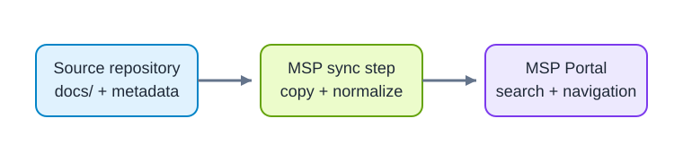

# Documentation overview

This directory is the complete publication surface synchronized into MSP Portal. Keep reader-facing Markdown and every asset required to render it directly in this folder.

## How publishing works



MSP reads `.docs-source.yml`, copies this directory, and builds shared navigation and search. Files outside `docs/` are not part of the published source.

## Add reader content

- Create focused Markdown pages directly under `docs/` with descriptive kebab-case names.
- Keep images and diagrams beside the page that uses them and reference them with relative paths.
- Link new pages from this overview when readers need a browsing path.
- Keep contributor instructions, writing standards, and reusable author guidance under the repository-level `guides/` directory.

## Validate before publication

Run the content review gateway from the repository root:

```shell
node scripts/review-content.mjs --portal ../msp
```

A successful run confirms that the flat publication structure, Markdown, links, assets, metadata, and current MSP rendering contract are compatible.
