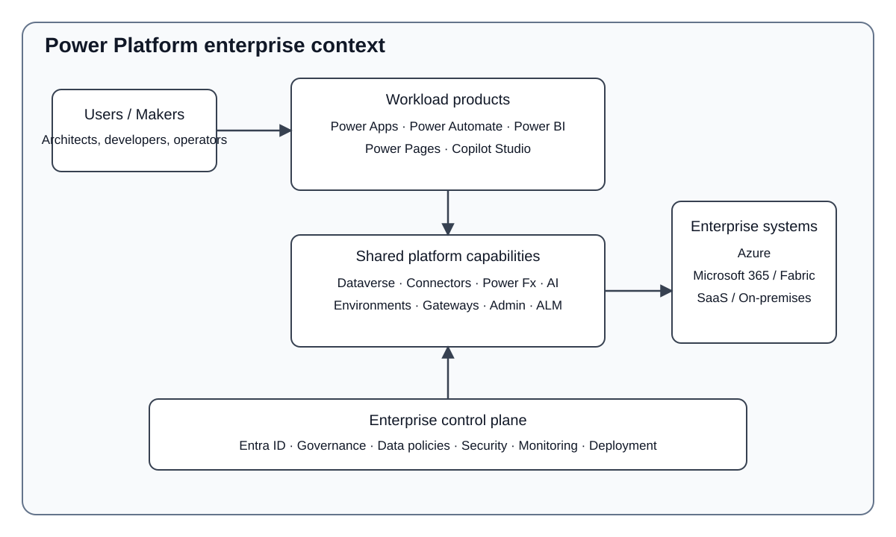

# Power Platform overview

This section gives enterprise architects, platform engineers, solution architects, senior developers, and technical leads an engineering view of Microsoft Power Platform. It explains the service boundary, shared platform architecture, production controls, trade-offs, and service-selection criteria without treating the platform as a single undifferentiated low-code product.

## Executive summary

Power Platform combines application, automation, analytics, web, and agent experiences with shared platform capabilities such as Dataverse, connectors, environments, identity integration, governance, and application lifecycle management. For production architecture, the visible products are only one layer; environment strategy, data ownership, connector behavior, security, ALM, observability, and external integration determine the reliability and operability of the workload.

## System context and boundaries

Power Platform sits between users and enterprise systems. Power Apps, Power Automate, Power BI, Power Pages, and Copilot Studio are workload-facing services. Dataverse, connectors, Power Fx, environments, gateways, administration, security, and ALM are shared platform capabilities that shape how those workloads run.

Azure, Microsoft 365, Dynamics 365, Microsoft Fabric, SaaS products, and on-premises systems can integrate with Power Platform, but they remain external or adjacent platforms with their own ownership and runtime boundaries.

## Overview documentation set

- [Services and platform capabilities](services-and-platform-capabilities.md) defines what belongs to Power Platform and separates products from shared platform capabilities.
- [Platform architecture](platform-architecture.md) describes environment, identity, data, connector, governance, ALM, observability, and runtime boundaries.
- [Engineering trade-offs](engineering-tradeoffs.md) evaluates strengths, constraints, bottlenecks, security risks, and operational consequences.
- [Service selection](service-selection.md) maps workload characteristics to the appropriate Power Platform service or to a hybrid/custom architecture.

## Architectural baseline

The baseline adopted by this documentation is:

- Treat the Power Platform environment as the primary workload isolation and lifecycle boundary.
- Use separate development, test/UAT, and production stages for production workloads.
- Do not use the Default environment as the standard destination for enterprise production workloads.
- Use Dataverse when its managed relational, security, solution, and application-platform capabilities fit the domain; do not copy enterprise data into Dataverse without an ownership reason.
- Treat connectors as integration dependencies with authentication, authorization, throttling, latency, retry, availability, and data-policy implications.
- Separate human identity from unattended workload identity where supported.
- Keep production changes solution-aware and deployment-controlled instead of editing production directly.
- Use central governance with delegated workload ownership.
- Define monitoring, audit, failure visibility, ownership, and escalation as part of the architecture.

## Production baseline

A typical production delivery path is:

Development -> source control and validation -> test/UAT -> approval -> production.

This is an architectural baseline rather than a requirement for every prototype. Lightweight personal productivity solutions can use a simpler lifecycle, but business-critical workloads should make environment placement, deployment, security, data ownership, and operational support explicit.

## Architecture quality model

Use the five Power Platform Well-Architected pillars as the base assessment model:

- Reliability
- Security
- Operational Excellence
- Performance Efficiency
- Experience Optimization

MSP adds three enterprise concerns when reviewing workload design: integration, maintainability/ALM, and cost/licensing/capacity. These additions do not replace the Microsoft framework; they make common enterprise decision factors explicit.

## Scope of this initial release

This initial Overview set captures the decisions approved through the shared platform foundation. Detailed service-specific architecture, beginning with Power Apps, remains follow-up work and should be added only after its design decisions are explicitly accepted.

## Authoritative references

- [Microsoft Power Platform guidance](https://learn.microsoft.com/en-us/power-platform/guidance/)
- [Power Platform and Copilot Studio Architecture Center](https://learn.microsoft.com/en-us/power-platform/architecture/architecture-center-overview)
- [Power Platform Well-Architected pillars](https://learn.microsoft.com/en-us/power-platform/well-architected/pillars)
- [Power Platform environments overview](https://learn.microsoft.com/en-us/power-platform/admin/environments-overview)
