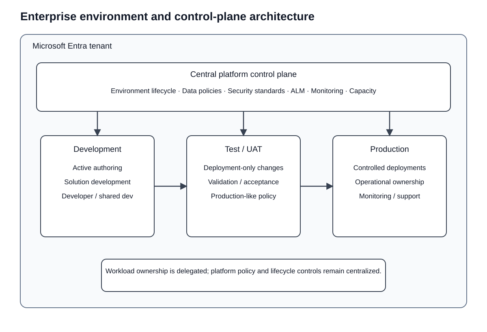
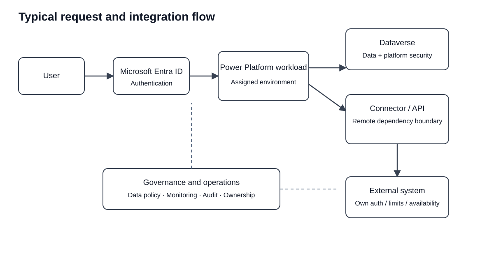

# Power Platform platform architecture

This page defines the shared enterprise architecture that Power Platform workloads inherit before service-specific design is considered. It focuses on environment boundaries, identity, Dataverse, connectors, governance, ALM, observability, and integration with external systems.

## Executive summary

The recommended enterprise model separates workload experiences from the shared platform and control plane. Environments provide the core lifecycle and isolation boundary; Microsoft Entra ID provides tenant identity; Dataverse and connectors provide data and integration paths; governance and ALM control how solutions are built, moved, secured, and operated.

## System context and boundaries

The architecture has three logical areas:

1. **Workload experience:** Power Apps, Power Automate, Power BI, Power Pages, and Copilot Studio.
2. **Shared platform:** Dataverse, connectors, connections, Power Fx, gateways, and environment-scoped resources.
3. **Enterprise control plane:** Microsoft Entra ID, environment administration, data policies, Managed Environments where appropriate, ALM, monitoring, audit, and support ownership.

Azure, Microsoft 365, SaaS, and on-premises systems remain external dependencies even when a connector makes them easy to consume.

## Environment and isolation model

Treat an environment as the primary administrative, lifecycle, regional, and workload isolation boundary. Microsoft documents environments as containers for business data, apps, flows, connections, gateways, and related resources, and binds each environment to a Microsoft Entra tenant and geographic location.

Do not prescribe one environment per application or one environment per department. Choose isolation based on:

- business ownership
- security and regulatory boundaries
- geographic or data-residency requirements
- criticality and blast radius
- deployment lifecycle
- Dataverse ownership
- integration dependencies

A production estate can therefore contain multiple production environments where isolation needs differ.

### Default environment stance

The tenant Default environment is a shared productivity space and is not the standard destination for enterprise production workloads. Production applications should receive intentional environment placement based on ownership, security, data, lifecycle, and support requirements.

**Security risk:** broad maker access and shared dependencies can increase the blast radius of mistakes in a shared environment.

**Operational trade-off:** stronger environment isolation improves control but increases deployment, capacity, connection, and administration overhead.

## Identity and authorization

Separate human identity from unattended workload identity where supported.

- Use Microsoft Entra identities for users.
- Prefer groups and teams for scalable authorization where the target service supports them.
- Apply least privilege.
- Use workload or service identities for unattended integration where the platform and connector support that model.
- Make connection ownership explicit for business-critical automation.

Client-side checks are not an authorization boundary. Authorization must be enforced by the data source, platform security model, API, or other trusted server-side control.

**Security risk:** critical integrations tied to an employee's personal credentials can fail during role changes and can grant privileges that are difficult to govern.

## Data ownership and Dataverse

Dataverse is a managed SaaS data and application platform and is a strong fit for transactional business data that benefits from a relational domain model, platform security, solution-aware configuration, and Power Platform integration.

Do not move data into Dataverse solely because a workload uses Power Platform. Preserve external system-of-record ownership when another platform already owns the data or when requirements call for a specialist data store, high-volume telemetry store, analytical platform, or different scaling model.

**Trade-off:** centralizing application data in Dataverse simplifies platform integration but can create avoidable duplication, synchronization, capacity, and ownership problems when the source of truth is elsewhere.

## Connector and integration model

Treat each connector as an integration boundary with its own dependency characteristics.

Review at minimum:

- authentication and authorization
- data classification
- API and connector limits
- latency
- retry behavior
- idempotency
- availability
- region or data-location implications
- connection ownership
- upstream vendor dependencies
- failure and recovery behavior

Power Platform data policies should be part of the enterprise control model. They provide guardrails over connector usage and help reduce unintended data exposure.

When integration becomes domain-critical, reusable, high-volume, or operationally complex, place a stable API or service boundary between Power Platform and underlying systems instead of coupling many apps and flows directly to vendor APIs.

**SPOF risk:** a custom API introduced as a central integration layer can itself become a single point of failure unless it is designed for appropriate availability, scaling, and observability.

## Data flow and key operations

A representative interaction is:

1. A user authenticates through Microsoft Entra ID.
2. A Power Platform workload runs in its assigned environment.
3. The workload reads or writes Dataverse, or invokes an external dependency through a connector or enterprise API.
4. Data policies and platform controls constrain allowed connector usage.
5. The downstream system applies its own authorization and availability behavior.
6. Monitoring and audit data must allow operators to trace failures across the participating services.

The important invariant is that low-code composition does not collapse distributed-system boundaries. A connector call still crosses identity, network, availability, throttling, and ownership boundaries.

## Application lifecycle management

Use solutions as the transport and lifecycle unit for solution-aware Power Platform components. Production delivery should follow a controlled path such as:

Development -> source control and validation -> test/UAT -> approval -> production.

Microsoft recommends managed solutions for nondevelopment environments and provides Power Platform pipelines for governed deployment automation.

Baseline rules:

- Development environments allow active authoring.
- Shared development should be controlled when multiple makers collaborate.
- Test/UAT should receive deployed changes rather than ad hoc edits.
- Production should receive deployed changes rather than direct maker changes.
- Environment variables and connection references should separate solution logic from environment-specific configuration.
- Deployment history and ownership should be auditable.

**Reliability risk:** direct production editing creates configuration drift and makes rollback, peer review, and incident reconstruction harder.

## Governance operating model

Use central governance with delegated workload ownership.

Central platform responsibilities include:

- tenant-wide policy
- environment lifecycle and grouping
- data and connector policies
- shared security standards
- ALM standards
- platform monitoring and capacity oversight

Workload teams remain responsible for:

- business functionality
- workload-specific access
- solution design
- testing
- operational ownership
- application-level monitoring and support

This avoids two extremes: a fully centralized model that becomes a delivery bottleneck and a fully decentralized model that produces inconsistent security and operational controls.

Managed Environments are the preferred enterprise governance posture where workload and licensing conditions allow them, but they are not a technical prerequisite for every Power Platform workload.

## Non-functional requirements

### Reliability

- Identify connector and external-system dependencies.
- Define retry and recovery behavior for remote calls.
- Isolate critical workloads where shared failure domains are unacceptable.
- Define ownership and escalation for production incidents.

### Security

- Apply least privilege at user, group, Dataverse, connector, and API boundaries.
- Use data policies to govern connector usage.
- Avoid personal credentials as hidden workload dependencies.
- Treat offline or exported data as a separate endpoint-security concern where applicable.

### Operational excellence

- Keep deployments controlled and auditable.
- Define monitoring for failed automation, integration failures, platform health, and security events.
- Use correlation identifiers or equivalent tracing when a transaction crosses multiple services.

### Performance efficiency

- Design for connector/API limits and latency.
- Minimize unnecessary round trips and cross-system data movement.
- Test representative volume early instead of assuming the managed service removes all scalability constraints.

### Experience optimization

- Select the workload product based on the interaction model rather than forcing every experience into one service.
- Keep business-critical latency and failure behavior visible to the UX where the user needs to recover or retry.

## Architecture decisions and trade-offs

| Decision | Why | Consequence |
| --- | --- | --- |
| Environment as primary workload boundary | Aligns lifecycle, resources, region, and administration | More environments increase governance and deployment overhead |
| Dataverse when domain fit is strong | Provides managed business data, security, and Power Platform integration | Capacity, licensing, and platform dependency must be managed |
| Connector governance as part of architecture | Connector combinations determine where data can move | Policies add operational change management and can block workloads |
| Controlled ALM for production | Improves traceability, repeatability, and recovery | Reduces immediacy compared with direct editing |
| Central governance plus delegated ownership | Scales policy without centralizing every delivery decision | Requires clear responsibility boundaries |
| Hybrid API/service boundary when integration is complex | Reduces coupling and centralizes domain integration behavior | Introduces another service to operate and secure |

## Authoritative references

- [Power Platform environments overview](https://learn.microsoft.com/en-us/power-platform/admin/environments-overview)
- [Microsoft Dataverse reference architectures and solution ideas](https://learn.microsoft.com/en-us/power-platform/architecture/products/microsoft-dataverse)
- [Power Platform data policies](https://learn.microsoft.com/en-us/power-platform/admin/wp-data-loss-prevention)
- [Managed Environments overview](https://learn.microsoft.com/en-us/power-platform/admin/managed-environment-overview)
- [Application lifecycle management basics](https://learn.microsoft.com/en-us/power-platform/alm/basics-alm)
- [Overview of pipelines in Power Platform](https://learn.microsoft.com/en-us/power-platform/alm/pipelines)
- [Enterprise Power Platform ALM reference architecture](https://learn.microsoft.com/en-us/power-platform/architecture/reference-architectures/enterprise-power-platform-alm)
