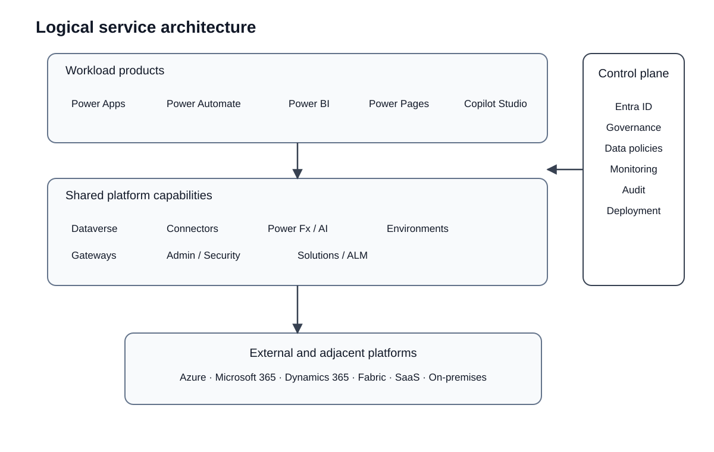

# Power Platform services and platform capabilities

This page defines the Power Platform service taxonomy used by MSP architecture documentation. The purpose is to separate user-facing products from shared platform capabilities so that architecture discussions do not treat every component as an equivalent service boundary.

## Executive summary

Power Apps, Power Automate, Power BI, Power Pages, and Copilot Studio are the primary workload products covered by this documentation. Dataverse, connectors, Power Fx, AI capabilities, environments, gateways, administration, governance, security, and ALM are shared capabilities that support or constrain those workloads.

## Product workloads

| Product | Primary responsibility | Architectural focus |
| --- | --- | --- |
| Power Apps | Low-code business application experiences | UI model, data access, delegation, security, component reuse, client/runtime behavior |
| Power Automate | Workflow and process automation | Triggers, orchestration, retries, concurrency, idempotency, connector limits, long-running execution |
| Power BI | Analytics and business intelligence | Semantic models, refresh, query paths, capacity, data ownership, governance |
| Power Pages | External-facing business websites | Identity, authorization, Dataverse exposure, web security, caching, public/partner access |
| Copilot Studio | Agent and conversational experiences | Grounding, tools/actions, identity, governance, safety, orchestration, observability |

These products can participate in the same business solution, but each has a different runtime model and different failure modes.

## Shared platform capabilities

| Capability | Role in the architecture | Main engineering concerns |
| --- | --- | --- |
| Microsoft Dataverse | Managed SaaS business data and application platform | Data ownership, relational model, security, capacity, solution lifecycle, extensibility |
| Connectors | Typed integration surface over APIs and services | Authentication, authorization, throttling, latency, availability, data policy, vendor dependency |
| Power Fx | Low-code expression language | Client/business logic placement, maintainability, delegation, testability |
| AI Builder and shared AI capabilities | Managed AI features consumed by workloads | Model suitability, data exposure, latency, cost, governance, human review |
| Environments | Administrative, lifecycle, regional, and resource boundary | Isolation, region, ownership, deployment stages, blast radius |
| On-premises data gateway | Bridge to supported on-premises data sources | Availability, patching, network reachability, credential ownership, capacity |
| Power Platform admin center | Tenant and environment management plane | Environment lifecycle, security, monitoring, governance, licensing |
| Data policies and connector governance | Control over connector combinations and allowed usage | Data exfiltration risk, policy scope, rollout impact, enforcement |
| Solutions and pipelines | ALM and deployment mechanism | Versioning, promotion, dependencies, environment configuration, rollback strategy |

## Adjacent platforms

The following technologies commonly appear in Power Platform architectures but are not classified here as Power Platform services:

- Microsoft Azure
- Microsoft 365
- Dynamics 365 applications
- Microsoft Fabric
- external SaaS platforms
- on-premises systems
- custom APIs and pro-code services

Keeping these boundaries explicit matters because availability, security, support, data ownership, and change management remain separate even when Power Platform provides a connector or integration path.

## Component relationship

The workload products depend on common control and integration capabilities, but not every workload requires every shared capability. For example, Dataverse is central to many model-driven applications but is not a mandatory store for every Power Platform solution.

## Engineering implications

### Dataverse is preferred when it fits, not mandatory

Use Dataverse when the workload benefits from a managed relational business data model, platform security, application integration, and solution-aware lifecycle. Preserve external system-of-record ownership when another platform already owns the data or when the workload needs a specialist store.

**Trade-off:** Dataverse reduces custom infrastructure ownership but introduces platform capacity, licensing, modeling, and service-dependency considerations.

### Connectors are dependencies, not just conveniences

A connector simplifies use of an API, but it does not remove the external system's limits or failure behavior. Production designs must evaluate authentication, throttling, latency, retry behavior, vendor availability, and data-policy constraints.

**Bottleneck risk:** connector or upstream API throttling can become the effective throughput limit of the workload.

**Security risk:** poorly governed connector combinations can create unintended data movement paths.

### Environments are workload boundaries

An environment contains apps, flows, connections, gateways, and optionally Dataverse. Environment placement therefore affects access, lifecycle, regional behavior, support ownership, and blast radius.

**Trade-off:** stronger isolation improves governance and failure containment but increases environment and deployment overhead.

## Authoritative references

- [Microsoft Power Platform guidance](https://learn.microsoft.com/en-us/power-platform/guidance/)
- [Microsoft Dataverse reference architectures and solution ideas](https://learn.microsoft.com/en-us/power-platform/architecture/products/microsoft-dataverse)
- [Power Platform environments overview](https://learn.microsoft.com/en-us/power-platform/admin/environments-overview)
- [Power Platform data policies](https://learn.microsoft.com/en-us/power-platform/admin/wp-data-loss-prevention)
